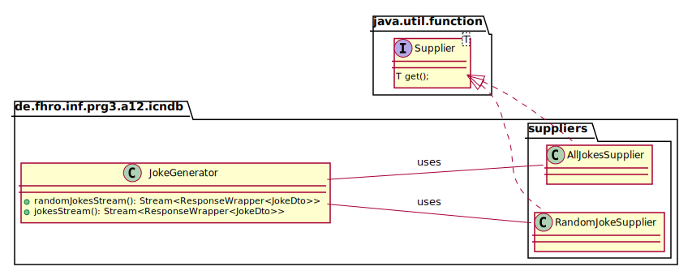
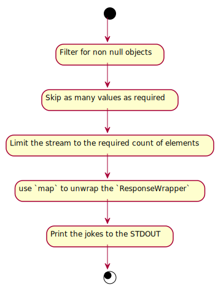

_This is an assignment to the class [Programmieren 3](https://hsro-inf-prg3.github.io) at the [University of Applied Sciences Rosenheim](http://www.fh-rosenheim.de)._

# Assignment 12: Functional - CLI variant

This assignment covers the basics of the Java 8 `Stream` API.
Streams are a functional concept and are relatively new in Java but they are very useful in combination with all kinds of _iterable_ data sources.
Streams may look a little bit complicated but when you got the concept they improve the readability of your code because they are more _data pipeline_ oriented as normal Java code is where you always have to iterate a collection with any kind of loop.

## Setup

1. Create a fork of this repository (button in the right upper corner)
1. Clone the project (get the link by clicking the green _Clone or download button_)
1. Import the project to your **IntelliJ**
1. **Read the whole assignment spec!**

_Remark: the given test suite is incomplete but will succeed after the checkout._

## Generators

A generator is component that creates a `Stream`.
There are two kinds of streams:

* finite
* infinite

A stream based on a list of objects is a finite stream as there are only a discrete number of elements that can be iterated.

Infinite streams are seaming to be a little bit weird but they are also very useful.
Think of a pseudo random number generator.
An infinite stream may be used to produce as many random numbers as required.
This generator may be implemented like this:

```java
public abstract class PseudoRandomNumberGenerator {

    private PseudoRandomNumberGenerator() {
    }

    public static Stream<Integer> createStream() {
        return Stream.generate(new PseudoRandomNumberSupplier());
    }

    private static class PseudoRandomNumberSupplier implements Supplier<Integer> {

        private final Random random = new Random();

        @Override
        public Integer get() {
            return random.nextInt();
        }
    }
}
```

The stream may be used like this:

```java
Stream<Integer> prngStream = createStream();
prngStream
        .limit(10)
        .forEach(System.out::println);
```

_Note that the `limit(...)` operation is mandatory because the stream is infinite and otherwise the whole operation will not terminate!_

In this part of the assignment you have to implement two generators as shown in the following UML:



_Remark: the UML is incomplete and is meant as implementation hint!_

1. Implement the `RandomJokeSupplier` - this supplier returns a random joke every time it is used.
1. Implement the `AllJokesSupplier` - this supplier iterates all jokes in an infinite loop i.e. if all jokes were retrieved it continues with the first joke.
1. Implement the `JokeGenerator` - the generator returns infinite streams based on the implemented suppliers.
1. Complete the test suite to ensure that your generators are working correctly!

Note that the class structure is already there (including the empty unit tests).
You may also implement the unit tests after the next part of the assignment.

## Using the generators

The given class `App` already implements a basic _CLI_ interface.
To complete the assignment implement the required code marked with a _TODO_.

The following flow diagram explains how to use the `jokesSource`:



Every chart element corresponds to a single method call on the stream of jokes.
For further reading about the Java 8 streams have a look at [this article](http://winterbe.com/posts/2014/07/31/java8-stream-tutorial-examples/).

_Remark: this part is technically an one-liner. To improve the readability add line breaks after every stream transformation. That should result in 5-6 lines of code._

If you want to improve your knowledge about streams you could extend the assignment by asking the user if he wants to filter the jokes for a specific category and if so which category (read the category as string).
Then `filter` the stream after the _unwrap_ transformation for the chosen category.